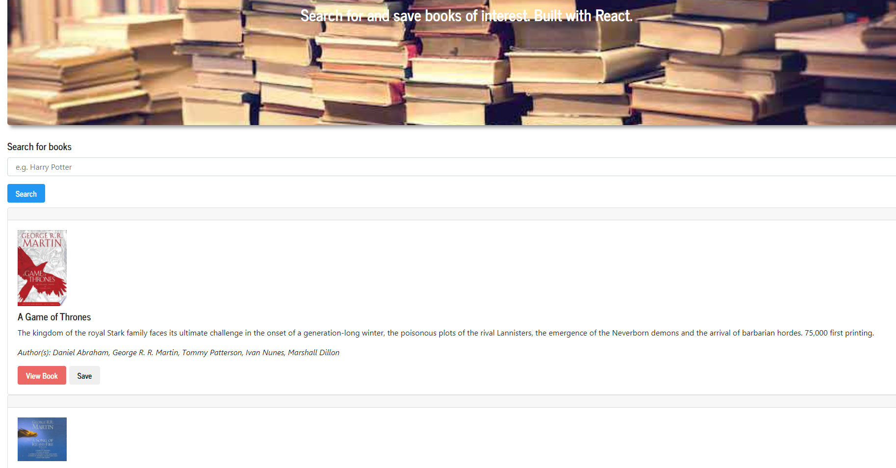

# GoogleBooksSearch

## Description
An application created using the MERN stack and allows users to search for books via the Google Books API. Search results are dynamically rendered in the UI and users have the option to save and/or delete books.

Visit the deployed aplication here! https://google-books-search-12.herokuapp.com/

## Technologies Used
<ul>
    <li>React JS</li>
    <li>MongoDB</li>
    <li>Mongoose</li>
    <li>Node JS</li>
    <li>Axios</li>
</ul>

## Installation
Clone the repository from Github and then from the terminal, npm install and run npm start and go to https:// localhost:3000.